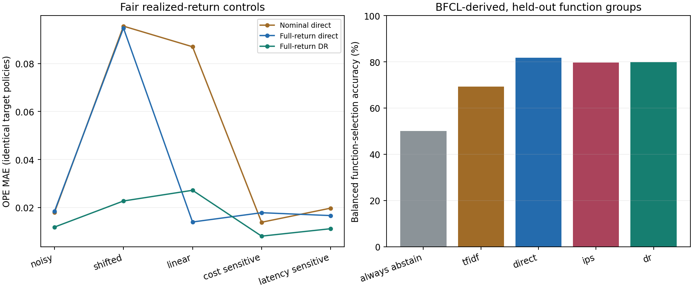

# Counterfactual Tool Ranking

A reproducible study of tool selection under utility, cost, and privilege
constraints: deterministic full-action authorization, exact-propensity logging,
direct/IPS/DR learning, selective execution, and real local MCP transport.

**Read working paper v2:** [PDF](paper/paper.pdf) | [Markdown](paper/paper.md).
**New evidence:** [v2 tables](artifacts/v2/tables.md) | [public/LLM diagnostics](artifacts/v2/diagnostics.md) | [v2 protocol](EXPERIMENTS_V2.md).
**Preserved v1:** [tables](artifacts/v1/tables.md) | [protocol](EXPERIMENTS.md).

The original frozen matrix has 45 runs across nine settings and five seeds, with 387,000
logged decision instances and 90,000 test task-condition instances. Conditions
reuse fixtures; these counts do not represent that many independent unique tasks.
Version 2 adds 30 complete-return control runs, 15 BFCL-derived runs on 1,930
retained public tasks, and two real local LLM baselines on the same 200 held-out
tasks. The BFCL-derived study is function selection, not an official leaderboard
or end-to-end execution score. Provenance and licenses: [DATA_SOURCES.md](DATA_SOURCES.md).

## Run locally

Python 3.11+ is required. No credentials, paid APIs, or production data are needed.

```sh
python3 -m venv .venv
.venv/bin/python -m pip install -r requirements.txt -r requirements-dev.txt
.venv/bin/python -m unittest discover -p 'test_*.py' -v
.venv/bin/python run.py run
```

Reports, figures, per-task outcomes, and partial-feedback logs are written to a
new directory under `results/`. Nonempty output directories are not overwritten.

```sh
.venv/bin/python run.py run --scenario noisy --seed 17 --epsilon 0.5
.venv/bin/python run.py run --exclude-logged-tool docs.batch_get
.venv/bin/python run.py replay --log results/RUN/train.jsonl
.venv/bin/python run.py run --backend mcp --scenario noisy \
  --train-size 600 --calibration-size 200 --test-size 400
.venv/bin/python suite.py --out results/reproduction
.venv/bin/python verify_artifacts.py
.venv/bin/python verify_v2.py
.venv/bin/python v2_experiments.py --out results/v2-reproduction
```

Optional local open-weight models (Apple silicon, no API key):

```sh
.venv/bin/python -m pip install -r requirements-llm.txt
.venv/bin/python public_llm.py --model 0.5b --out results/qwen-small
.venv/bin/python public_llm.py --model 1.5b --out results/qwen-large
```

## What is implemented

- Eleven executable tools across document reads, ticket closure, and customer
  discounts. Typed resource/numeric arguments and SQLite terminal-state checks.
- User/group scope-resource grants, inherited prefixes, explicit deny precedence,
  server-owned authority, and execution-time revocation checks.
- Official MCP Python SDK 2.2.0 client and independent stdio server. The included
  VS Code MCP configuration exposes a synthetic demo with no production access.
- Exact randomized partial-feedback logs, tool/candidate snapshots, schema/hash
  validation, and semantic replay. Zero logging support is never silently imputed.
- Cross-fitted DR and IPS regression, direct models, matched conservative variants,
  independent calibration, ESS diagnostics, bootstrap intervals and hindsight oracle.
- Clean/noisy/shifted conditions, stale observations, injected failures, data and
  exploration budgets, linear-model ablation, cost and latency sensitivity.
- Fixed multi-seed suite, public per-run summaries, generated figures/tables,
  source hashes, artifact verification, unit/integration tests and GitHub Actions.
- Full realized-return and component-wise direct baselines with matched-return
  DR controls; version-1 source and artifacts stay unchanged.
- Pinned BFCL data, full role-labeled public context, function-group-disjoint
  splits, label-free lexical features and group-bootstrap diagnostics.
- Disagreement-support policy contrasts, bounded missing-outcome intervals and
  baseline-preserving fallback, with explicit conditional-confidence limits.
- Actual local Qwen2.5 0.5B/1.5B inference, exact task matching, per-class results,
  JSON/schema checks, token counts and pinned model/adapter hashes.

## What the results say

**The stronger baseline changes the conclusion.** In the v2 linear setting,
full-return direct OPE MAE is 0.0139, better than full-return DR at 0.0272.
Under shifted conditions, DR still helps: 0.0227 versus 0.0948. Version 1's
nominal-cost comparison is retained for audit, not promoted as a universal result.

On native BFCL-derived held-out function groups, direct balanced accuracy is
81.85%, compared with 69.23% for TF-IDF and 79.83% for DR. Always abstaining is
50% by this balanced metric. Tiny local models fail on the 128 should-abstain
tasks; their per-class and same-task comparisons are reported, not concealed.
The selected dataset also has a candidate-count shortcut. On the post-run
multi-candidate-only cohort, direct balanced accuracy is 76.80%, versus 64.89%
for TF-IDF and 72.26% for DR; those more conservative diagnostics are published too.

Disagreement fallback identifies the relative policy change in all five missing-
support runs even when both absolute policy values are unidentifiable. This
eliminates structural ambiguity, **not sampling uncertainty or business risk**:
the conservative bound certifies no automatic promotions. The theoretical
observation is positioned relative to existing partial-identification work;
novelty is not asserted merely from combining known methods.



The executable business workload remains **synthetic**, and public bandit logs
are newly randomized reductions of BFCL labels. Real MCP transport does not make
costs or privileges production measurements. The two LLMs are real local models,
but are small and not representative of frontier systems. No paid API,
external enterprise account or private trajectory is used. Multi-step offline RL,
human approval workflows, arbitrary connectors and large-catalog retrieval remain open.
It is not a drop-in production authorization gateway. See [SECURITY.md](SECURITY.md).

## Build the paper

```sh
npm ci --prefix paper
npx --prefix paper playwright install chromium
npm run pdf --prefix paper
```

The build reads committed experiment JSON, fills the result tables and claims,
renders math offline, and checks the document in headless Chromium. It does not
open or switch a visible browser. See [paper/README.md](paper/README.md).

## Repository map

| File | Responsibility |
| --- | --- |
| `sandbox.py` | Domain state, tool actions, authorization, fixture generation |
| `learning.py` | Exact logger, features, learners, OPE and support diagnostics |
| `execution.py`, `mcp_server.py` | Local and real MCP transports |
| `run.py` | Single experiment and replay CLI |
| `suite.py` | Frozen matrix, aggregate statistics and public exports |
| `test_experiment.py`, `test_mcp.py` | Regression and subprocess protocol tests |
| `verify_artifacts.py` | Recompute published summaries and check source hashes |
| `v2_learning.py`, `v2_experiments.py` | Complete-return controls and fixed v2 runs |
| `public_data.py`, `public_learning.py`, `public_llm.py` | BFCL adapter, bandit reduction and local LLM evaluation |
| `policy_contrast.py` | Paired improvement estimates and missing-support bounds |
| `analyze_v2.py`, `verify_v2.py` | Matched/grouped diagnostics and source-linked v2 checks |
| `artifacts/` | Small public metrics and figures; raw logs stay gitignored |
| `paper/` | Manuscript source, rendered first draft, PDF and build tooling |

The original deterministic prototype was developed independently of production
services. This standalone repository contains research code, synthetic aggregates
and public-dataset-derived task-ID metrics; no application history or deployment credentials.
