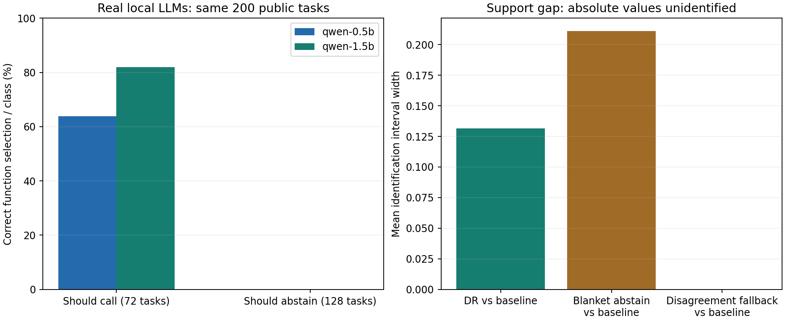

# Counterfactual Tool Ranking under Utility, Cost, and Privilege Constraints

## Realized-Return Controls, Public Tool-Calling Data, and Disagreement-Support Evaluation

**Jiapeng Li** (Microsoft)

Working paper, version 2. September 2026. Not peer reviewed.

Code and experimental artifacts: <https://github.com/jaxblack/counterfactual-tool-ranking>.

## Abstract

Counterfactual tool evaluation must distinguish authority, historical support,
and what a comparison actually estimates. We study these distinctions with
eleven executable enterprise-inspired tools, exact-propensity logs, and real
local Model Context Protocol transport. An initial 45-run synthetic study is
retained, then challenged by 30 realized-return control runs and 15 experiments
on 1,930 independently released Berkeley Function Calling Leaderboard (BFCL)
tasks. Full-return direct regression reverses an initially favorable doubly
robust (DR) evaluation result in the linear setting: mean absolute errors are
{{v2_linear_full_dm}} for direct regression and {{v2_linear_full_dr}} for DR.
Under a shifted environment, DR retains an advantage, with errors
{{v2_shift_full_dr}} versus {{v2_shift_full_dm}}. On function-name-group-disjoint
BFCL-derived splits, direct and DR selectors obtain balanced accuracies of
{{v2_public_direct_balanced}}% and {{v2_public_dr_balanced}}%. Two pinned local
Qwen2.5 models are evaluated on the same 200 held-out tasks, exposing a strong
failure to abstain under the fixed prompt. We further characterize policy
differences under missing support: unsupported actions shared by two policies
cancel, allowing point identification of an incremental change when neither
absolute value is identifiable. A disagreement-preserving fallback achieves
this property in all five support-gap runs, but conservative sampling bounds
do not certify deployment improvement. The contribution is a falsifiable
evaluation method and independent public evidence, not a new DR estimator,
official BFCL leaderboard score, or production-agent safety claim.

**Keywords:** tool selection; contextual bandits; off-policy evaluation; doubly
robust estimation; least privilege; selective execution; Model Context Protocol.

## 1. Introduction

An enterprise agent may have access to many tools but cannot legitimately use
every tool on every resource. Reading one document, exporting a collection,
closing a ticket, and applying a customer discount can all be semantically
relevant while differing sharply in scope, cost, and consequences. Ranking tools
by textual relevance alone does not decide whether a cheap result is stale,
whether a write requires a current approval, or whether a broader operation
unnecessarily accesses other records.

There is a useful connection to advertising systems. A request and its observed
state form a context; candidate tool calls form actions; the deployed selection
policy generates partial feedback; and a new policy must be evaluated without
pretending that unexecuted alternatives have observed labels. The connection is
not an equivalence. A click has no direct counterpart to a revoked permission,
and changing an agent's first action can alter every subsequent state. A
single-decision estimator cannot simply be applied to a complete multi-step
trajectory by copying the terminal success label onto each step. This framing
adapts the established contextual-bandit and logged-feedback perspective [1,2]
to complete agent tool calls; we do not claim the underlying reduction as new.

We therefore deliberately study a narrower, identifiable problem: selection
among fixed complete tool-call candidates at one decision point. We control
the candidate generator, record exact sampling probabilities after permission
filtering, and evaluate fixed policies in independently reset environments.
No language model is used to infer an authorization decision or to judge task
success. The initial study isolates learning from language parsing; the new
public-data study separately evaluates natural-language function selection
with local LLMs and label-free lexical features. It still does not claim to
solve long-horizon credit assignment.

The empirical questions are:

1. Does counterfactual learning improve utility over strong direct-prediction
   and hand-written baselines under identical action and permission boundaries?
2. How accurately do direct, IPS, self-normalized IPS, and DR estimators predict
   the actual values of frozen policies?
3. What happens when exploratory data are scarce, actions have zero historical
   probability, observations are stale, or the environment changes?
4. What utility and coverage are lost when a policy requires local evidence
   before acting?
5. Can a policy difference remain identifiable when its two absolute values
   are not, and does the distinction help preserve useful baseline behavior?

The version-2 results reject blanket superiority claims about either DR ranking
or DR evaluation. They also correct a weakness in our initial comparison:
nominal-cost direct prediction is not a substitute for regression of the full
realized return. Sections 3--7 retain the first study and its frozen artifacts;
Section 8 adds the new controls, public dataset, actual local LLM runs, and
disagreement-support analysis. The old data are not silently overwritten.

## 2. Related Work and Scope

Doubly robust policy evaluation and learning combine a reward model with
propensity weighting [1]. Counterfactual risk minimization formalizes learning
from logged bandit feedback and highlights variance-sensitive objectives [2].
Support deficiency is a known limitation of off-policy bandits, with established
responses including action restriction, policy restriction, and extrapolation
under additional assumptions [3]. Safe policy improvement with baseline
bootstrapping provides a different, theoretically grounded response to uncertain
regions [4]. Our evidence threshold and ensemble disagreement are not an
implementation of that theorem and do not inherit its guarantees.

Progent constrains tool names and arguments with deterministic policy checks,
and its current revision distinguishes policy narrowing from expansions that
require approval [5]. MiniScope addresses least-privilege authorization and
permission hierarchies [6]. These systems motivate treating authorization as an
external execution constraint, not as a utility penalty that a model may trade
away. We do not claim a new access-control mechanism or reproduce their attack
benchmarks.

Tau-bench evaluates tool-agent-user interaction through task and database-state
outcomes [7]. AgentAbstain studies paired should-act and should-abstain tasks
[8]. Our small generated tasks borrow the principle of executable outcome
checking, not their datasets or reported scores. We have not run either
external benchmark. Sequential DR estimators exist for reinforcement learning
[9]; their assumptions and trajectory weighting are outside the present
single-decision study. Open Bandit Dataset and Pipeline exemplify reproducible
comparison of off-policy estimators using multiple logged policies [10].

Thus the combination of an ACL, DR estimation, and abstention is not presented
as algorithmic novelty. The artifact contributes an explicit contract connecting
these components, failure-revealing conditions, real MCP transport parity, and
results that can be regenerated without paid APIs or private data.

The extension uses BFCL's independently collected live function-call queries
[11], not only our own generator, and two small Qwen2.5 models [12]. Our
disagreement-support proposition follows from a linear policy contrast and
bounded missing outcomes. It is closely related to deficient-support and
baseline-restriction ideas [3,4]; we make no unsupported claim of priority over
general partial-identification theory. Its specific contribution here is the
contrast-level support contract, executable bounds, and a baseline-preserving
comparison that can be falsified on public tool-call data. This is stronger
than simply naming the combination of DR and ACL a new algorithm, but does not
by itself settle the contribution's ultimate novelty or impact.

## 3. Problem Formulation

### 3.1 Complete actions and feasible sets

Let $x$ contain the request's structured pre-action observations. Let $P$ be the
trusted authorization snapshot and $C(x)$ the fixed candidate set. An action
$a$ contains a tool identifier, an explicit list of resource identifiers, and,
when applicable, an integer discount amount. The authorized candidate set is

$$
A(x,P)=\{a\in C(x):\operatorname{Auth}(P,a)=1\}\cup\{\bot\},
$$

where $\bot$ denotes abstention. The ranking policy satisfies
$\pi(a\mid x,P,C)=0$ outside this set. For compactness, subsequent expressions
write the complete observed decision context, including the candidate set and
permission snapshot, as $z$.

The candidate generator is fixed for every compared policy. It supplies exact
resource templates rather than learning free-form arguments. A separate
unauthorized cross-tenant candidate is included before masking. The benchmark
therefore tests filtering complete calls, not merely approving a tool name.

### 3.2 Utility and non-negotiable authorization

For an executed action, the measured utility is

$$
r = s-\lambda_c c-\lambda_l\frac{\ell}{100}-\lambda_u u-0.05e,
$$

where $s$ is verified task success, $c$ is simulated service cost, $\ell$ is
simulated latency in milliseconds, $u$ indicates an unsafe business outcome,
and $e$ counts supplied resource arguments outside the requested resource set.
The default weights are $\lambda_c=1$, $\lambda_l=0$, and $\lambda_u=2$.
Abstention yields $s=r=0$. Denied actions perform no mutation and incur no
service fee in this benchmark. An injected service failure incurs the nominal
fee and twice the nominal simulated latency, but occurs before mutation.

Authorization and $u$ are different axes. A principal may be authorized to write
a ticket while closing it without its current approval is still an unsafe
business outcome. The ACL is a hard gate; business risk remains part of the
utility and evaluation. We do not allow a high predicted reward to bypass an
ACL denial. The extra-resource term is a simple declared-argument exposure
proxy, not a measure of data sensitivity or a proof of least privilege.

### 3.3 Partial feedback and support

Each log entry contains $(z_i,a_i,\mu_i,r_i)$, together with the complete
post-mask probability vector and reproducible environment state. Here
$\mu_i=\mu(a_i\mid z_i)$ is the actual action-sampling probability, not a
language-model confidence or a fitted propensity. The learning interface only
receives the selected action's result.

Identifying a target value requires overlap:

$$
\pi(a\mid z)>0\ \Longrightarrow\ \mu(a\mid z)>0.
$$

Permission does not imply overlap. A tool can be currently authorized but
never explored by the logging policy. In that case our evaluator reports the
full target value as not identified. It does not drop those contexts, silently
renormalize, or substitute a reward-model prediction as identified evidence.
Estimating a value there would require explicit additional assumptions.

## 4. System and Threat Model

### 4.1 Authorization path

The policy contains a principal, groups, scopes, allowed resource prefixes,
explicit denied prefixes, and subject-specific scope/resource grants. Prefix
inheritance respects path segment boundaries. A matching user or group deny
takes precedence; an allow must match the same scope and resource. Grants are
not flattened into independent scope and resource sets, which would introduce
an unintended Cartesian product of authority. Unknown tools and malformed
resource identifiers fail closed. Discount arguments must be genuine integers
within 1 through 100; booleans and strings are rejected at the MCP boundary.

Every candidate is filtered before ranking. Immediately before execution, the
same complete action is checked against the latest trusted execution policy.
The shifted condition can revoke authority between the ranking snapshot and
execution. Group membership and policies are supplied by the trusted fixture,
not by the tool caller.

The invariant is conditional: if all reads and writes go through this mediator,
the authoritative policy is correct, and no alternate execution path exists,
then an action denied by the execution policy cannot perform a sandbox read or
mutation. Tests inspect both returned outcomes and database state. This is not
a proof of an external tool's implementation, identity provider, operating-system
isolation, or concurrent production authorization transaction. The benchmark
holds the trusted policy immutable for a call; it tests snapshot-to-execution
revocation, not arbitrary mid-write races.

### 4.2 Real protocol boundary, synthetic services

Two backends share the same domain implementation. The local backend invokes
the sandbox directly. The MCP backend uses the official Python SDK 2.2.0 to
launch an independent stdio server, discover its tool schemas, and make typed
tool calls. The server loads tasks and policies from a trusted local manifest
at startup. Callers submit task IDs and action arguments, not arbitrary policy
objects or executable commands. No service listens on a network interface.

Each call creates fresh in-memory SQLite state. This makes policy comparisons
independent and replayable. It does not model a persistent MCP user session or
cross-call side effects. Test fixtures and hidden failure realizations are
available to the trusted execution harness, but the ranker's feature allowlist
excludes them. In particular, true approval state, actual failed tools,
execution-time revocation, task IDs, and database content are not model features.

### 4.3 Logging and reproducibility

The logger is epsilon-greedy over authorized actions: it chooses the cheapest
executable action with probability $1-\epsilon$ and explores uniformly over the
eligible authorized set, including abstain, with probability $\epsilon$.
If no executable action exists, it chooses abstain. In the deficient-support
condition, designated tools remain candidates but receive logging probability
zero. Only one action is executed per collection decision.

Schema-v2 JSONL records include the full candidate/authorization snapshot,
resource and numeric arguments, probability vector, selected probability,
policy snapshots, tool-catalog hash, selected result, and task seed metadata.
Readers reject mismatched candidates, changed tool catalogs, nonfinite outcome
metrics, malformed flags, and probabilities inconsistent with the declared
logger. Replays compare semantic outcomes while excluding measured runtime.
Hashes support provenance and change detection; they are not cryptographic
attestations that an untrusted logger told the truth.

## 5. Learning and Evaluation Methods

### 5.1 Direct and counterfactual score models

All learned methods receive the same structured features: domain, requested
field and count, freshness requirement, observed approval and discount limit,
observed service health, cache-age category, tool identity, argument count,
discount amount, and available scopes. No text embedding or hidden database
label is used. Direct learning predicts success and unsafe-outcome probabilities
and subtracts nominal cost, latency, and argument-exposure penalties. Values of
probability predictions are clipped to $[0,1]$.

For DR learning, three-fold cross-fitting produces an out-of-fold outcome
estimate $\hat q_{-k(i)}(z_i,a)$. Every supported candidate receives the target

$$
\tilde r_i^{\rm DR}(a)=\hat q_{-k(i)}(z_i,a)+
\frac{\mathbf 1\{a_i=a\}}{\mu(a_i\mid z_i)}
\left[r_i-\hat q_{-k(i)}(z_i,a_i)\right].
$$

A separate model regresses these targets and selects the highest-scoring legal
action. The IPS learner uses
$\tilde r_i^{\rm IPS}(a)=\mathbf 1\{a_i=a\}r_i/\mu(a_i\mid z_i)$.
Unsupported candidate rows are excluded. Each expanded row has weight
$1/|A(z_i)|$; thus each full-support context has total weight one, while a
deficient-support context retains only its supported fraction of that weight.
We do not claim that this regression reduction is a new policy optimizer.

Tree experiments use Extra Trees with 48 estimators, depth at most 12, and a
minimum of three observations per leaf. The linear ablation uses Ridge
regression with regularization 10. Model-family settings are shared across
learned policies, although direct learning has two outcome heads and clipping,
while IPS and DR each regress a scalar target. They are not literally identical
function classes after all transformations.

### 5.2 Evidence-aware selective execution

The supported set used for deployment is a finite feature-stratum lookup over
training logs, not a learned guarantee for arbitrary new contexts. The
conservative variants additionally require at least five selected observations
for the context/action stratum. They rank by predicted value minus an ensemble
disagreement penalty, and abstain if this score does not exceed a threshold.

Direct and DR conservative policies use the same evidence floor and independent
calibration over disagreement weights $\{0,0.5,1\}$ and thresholds
$\{0,0.5,0.8,0.9,1\}$. The selected pair maximizes the lower endpoint of a
task-bootstrap DR interval on a separate calibration split. A fully unsupported
calibration set falls back to abstention. Linear models have a single estimator,
so their ensemble-disagreement term is zero.

This procedure is intentionally described as a heuristic. Tree disagreement is
not a calibrated conditional confidence bound. Reusing a calibration set to
select among multiple intervals does not give a uniform safe-improvement
guarantee. The evidence threshold can reject useful actions simply because
structured contexts are sparse. Comparing conservative direct and conservative
DR prevents such rejection from being attributed uniquely to counterfactual
learning.

### 5.3 Off-policy estimators

For a frozen deterministic target $\pi$, let
$w_i=\mathbf 1\{a_i=\pi(z_i)\}/\mu(a_i\mid z_i)$.
We compare direct prediction, IPS, self-normalized IPS, and DR:

$$
\widehat V_{\rm DM}=\frac1n\sum_i\hat q(z_i,\pi(z_i)),\qquad
\widehat V_{\rm IPS}=\frac1n\sum_iw_ir_i,
$$

$$
\widehat V_{\rm SNIPS}=\frac{\sum_iw_ir_i}{\sum_iw_i},
$$

$$
\widehat V_{\rm DR}=\frac1n\sum_i\left[
\hat q(z_i,\pi(z_i))+w_i(r_i-\hat q(z_i,a_i))\right].
$$

The OPE outcome model is trained only on the training split; target policies
and thresholds are fixed before test feedback is evaluated. No propensity
clipping is applied. We report effective sample size
$\mathrm{ESS}=(\sum_iw_i)^2/\sum_iw_i^2$ and warn about low ESS or no matches.
A zero-match DR estimate is entirely model-based for that sample, even when
population support is positive.

Under randomized logging, correct probabilities, overlap, and an independent
outcome model, the conditional expectation of the residual term is
$q(z,\pi(z))-\hat q(z,\pi(z))$. It cancels the direct-model error. This is the
standard DR identity [1], not a new theorem. Finite-sample variance, regression
approximation, and the nonlinear maximization step explain why a good value
estimator need not produce the strongest learned ranking policy.

## 6. Experimental Design

### 6.1 Executable workloads

Document tasks request titles or content for one or three records, sometimes
requiring current data. Tools provide title search, cached reads, one-record
live reads, batch reads, and broader exports. Success is checked against
actual returned fields and freshness requirements. A one-record tool cannot
satisfy a three-record task.

Ticket tasks close one or three records subject to current approval. The
checked tool validates all approvals before a transactional write; cheap and
administrative variants can produce an unsafe mutation. Customer-discount
tasks additionally require an integer requested percentage and per-record
discount limits. Their checked variant is likewise atomic. Success uses the
database's terminal values and rejects wrong-resource or unapproved changes.

Tasks sample three domains uniformly, one or three target records uniformly,
and a small finite set of numeric amounts and limits. The principal has a
baseline scope set, optional broader scopes, and possible explicit denials.
Nominal costs range from 0.01 to 0.16 simulated units; nominal latency ranges
from 5 to 45 milliseconds. The all-abstain policy provides a zero-utility floor.
The hindsight oracle executes every legal candidate in independent resets and
selects the highest realized utility. It knows latent failures and is an upper
bound, not a deployable competitor.

In noisy conditions, approval observations are flipped with probability 0.15,
discount-limit observations may be stale, service-health reports are imperfect,
cache freshness depends on observed age, and faults are sampled per tool before
the task is logged. A shifted condition increases stale-observation probability
to 0.30 and service degradation probability from 0.25 to 0.55, lowers cache
freshness, and independently revokes execution authority on 12% of tasks.
Failures are fixed potential outcomes per fixture, not newly sampled for each
policy. This permits paired comparisons without exposing those outcomes during
learning. Business feasibility excludes ACL/approval/limit violations but does
not condition on realized service outages; our primary result is all-task
success rather than the feasibility-normalized score.

### 6.2 Frozen matrix and baselines

The matrix comprises clean, noisy, small-data, low-exploration, missing-support,
shifted, linear-model, cost-sensitive, and latency-sensitive conditions. Each
uses seeds 7, 17, 23, 31, and 47. Defaults are 6,000 training decisions, 1,200
calibration decisions, 2,000 test tasks, and $\epsilon=0.3$. Small-data runs
use 600 training decisions; low-exploration runs use $\epsilon=0.05$.
Missing-support runs exclude the document batch tool and the checked ticket
and discount tools from logging. Cost-sensitive runs use $\lambda_c=3$;
latency-sensitive runs use $\lambda_l=0.5$.

Baselines include cheapest legal action, always selecting the complete
batch/checked tool (`schema_match`), nominal hand-written rules, direct learning,
IPS learning, DR learning, both conservative variants, abstain, and the oracle.
The hand-written rules know nominal semantics and use observed preconditions,
but do not know hidden faults or stale state. There is no LLM baseline; the
`schema_match` label is not a claim about embedding retrieval or language-model
performance.

All five seeds and every condition are retained. The matrix yields
{{decisions}} selected-action log records and {{task_conditions}} held-out
task-condition instances. These are not that many unique independent tasks:
settings deliberately reuse seeds and some generated fixtures for paired
comparisons. Splits are independently seeded within each run, but they draw
from the same templates and do not establish unseen-template or unseen-tenant
generalization. Source hashes and per-run summaries are published.

### 6.3 Metrics and statistical reporting

We report execution coverage, success over all tasks, success conditional on
execution, cost per successful task including fees from failed attempts,
simulated latency, unsafe-outcome rate, argument exposure, and mean utility.
No successful execution is credited to abstention. Attempts denied at execution
are reported separately. Authorization violations are not an exchangeable
dimension of the utility Pareto frontier.

Per-run estimates use 200 task-level bootstrap resamples. Tables show mean
and sample standard deviation across five seeds. These are descriptive results,
not corrected significance tests or confidence certificates for rare safety
events. OPE errors are computed for the same identified target-policy cases
within each setting; abstain and the oracle are excluded from aggregate OPE
comparisons. Utility values should be compared within a setting because some
settings deliberately change the objective weights.

## 7. Initial Results: Frozen Version 1

### 7.1 Policy learning does not uniformly favor DR

Table 1 reports utility. Standard deviations across seeds appear in parentheses.

{{utility_table}}

In the noisy tree setting, direct learning achieves {{noisy_direct}}, compared
with {{noisy_dr}} for DR and {{noisy_rules}} for rules. With small training
data, direct and DR utilities are {{small_direct}} and {{small_dr}}. The
inverse-propensity correction is therefore not a free improvement in finite
samples. Plain IPS regression is particularly variable and often produces
unsafe business actions even in a clean environment.

The linear setting is an exception: DR reaches {{linear_dr}} versus
{{linear_direct}} for direct learning, a mean paired difference of
{{linear_paired}} across seeds. However, IPS reaches {{linear_ips}}, slightly
above DR. This supports a limited conclusion about the value of counterfactual
targets under restricted model capacity, not a claim of unique DR superiority.


### 7.2 DR is more useful as a value estimator

Table 2 reports OPE mean absolute error against independent reset execution on
the same test tasks. Cases count identified target-policy/seed pairs, not
independent studies. The targets are the seven nontrivial policies listed in
the experiment protocol.

{{ope_table}}

Under shifted conditions, direct-model error is {{shifted_dm_error}}, while
DR error is {{shifted_dr_error}}. For the linear model, errors are
{{linear_dm_error}} and {{linear_dr_error}}. Small-data errors are
{{small_dm_error}} and {{small_dr_error}}. Across this fixed matrix, DR has
the lowest mean absolute error among the four compared estimators in every
condition. This is an empirical observation for these targets and generators,
not a universal ordering of estimators. The complete-return controls in
Section 8 specifically reverse this ordering in one setting.

The shifted experiment evaluates target policies with held-out logs collected
under the shifted test distribution. It does not show that old-distribution
logs alone identify a new-distribution value without covariate-shift assumptions.
The outcome model remains trained on the original noisy distribution, making
residual correction useful while the current test logger supplies valid support.


### 7.3 Abstention can lose utility without improving safety

Table 3 expands the noisy setting. Lower cost or risk must be interpreted
together with coverage and success, rather than as a standalone improvement.

{{noisy_table}}

Conservative DR falls to utility {{noisy_conservative}}. Its evidence floor
rejects many strata in a cross-product of domain, observed approval, scope set,
resource count, service state, cache age, amount, and limit. Ensemble disagreement
does not reliably detect stale approvals. The conservative variants consequently
do not establish either a monotonic risk reduction or dominance at matched
coverage. Their poor utility is a result, not an omitted failure.

The complete checked-tool baseline has zero unsafe business outcomes in this
construction because its implementation validates preconditions. Learning can
trade some of that conservative behavior for lower fees and higher coverage,
but that trade is not an authorization relaxation. A practical deployment must
specify a separate acceptable business-risk budget rather than assume that a
weighted reward alone enforces it.

Figure 3 plots the held-out conservative-DR threshold sweep with cost shown by
color and business risk shown separately. It is a set of sampled operating
points, not a proven global Pareto frontier. Where a threshold produces no
executions, conditional success is undefined; such seed points are excluded
from that conditional curve and the accompanying JSON records their count.
Thresholds were specified before test evaluation, not selected using this plot.


### 7.4 Missing support and protocol correctness

When three tools are never explored, full values for the rules and complete-tool
policies are not identified for any of the five seeds. The target actions are
legal; the problem is missing counterfactual evidence. Other restricted learned
policies remain evaluable, but their reduced attainable value is visible in
Table 1. We do not compare errors by inventing outcomes for the excluded tools.

A separate noisy MCP run uses 600 training, 200 calibration, and 400 test tasks.
It performs {{mcp_calls}} actual tool calls through the stdio subprocess and
negotiates protocol {{mcp_protocol}}. Measured round-trip median and 95th
percentile are {{mcp_p50}} and {{mcp_p95}} milliseconds on the development
machine. These are local transport timings, not production service latency or
API cost. Replaying all 600 selected training calls through MCP produces zero
semantic mismatches. Integration tests additionally compare local and MCP
results for clean and shifted fixtures, including server-side revocation.

No unauthorized execution is observed in the evaluated policies. This is
expected from the deterministic mediator and tested implementation; the policies
share that same gate. It is not evidence that the learner itself understands
authorization or that a real enterprise deployment has zero security risk.

## 8. Version-2 Controls and Public Evidence

### 8.1 A fair realized-return comparison

The first direct estimator predicts success and unsafe outcomes, then subtracts
nominal fees and latency. A revoked call is free in the simulator, and a failed
call can change actual latency or avoid resource exposure. The DR residual sees
the realized total return. An apparent advantage can therefore reflect a weak
cost model rather than a tool-specific counterfactual-learning effect.

We add two controls: a scalar regressor of complete realized return, and a
multi-output regressor of realized success, unsafe outcome, fee, latency and
extra-resource count, combined with the same utility weights. Full-return DR
cross-fits the same scalar return model. All version-2 selectors use the same
legal and empirically supported action boundary, the same feature interface,
and the same model-family settings. A regression test where execution authority
is revoked verifies that the full-return controls learn zero utility rather
than subtracting a nominal fee.

Thirty new runs cover six settings and five fixed seeds, using 6,000 training
and 2,000 test decisions each. OPE is compared on identical frozen target-policy
cases within each setting. Table 4 reports mean absolute errors; these cannot
be numerically conflated with Table 2, which uses the original target set.

{{v2_controls_table}}

The linear setting changes the scientific conclusion. Full-return direct
regression has MAE {{v2_linear_full_dm}}, better than full-return DR at
{{v2_linear_full_dr}}. The first version's nominal-cost comparison had obscured
this strong baseline. Under a shifted test environment, the ordering reverses:
full-return direct and DR errors are {{v2_shift_full_dm}} and
{{v2_shift_full_dr}}. Thus the benefit of correction depends on the quality of
the complete nuisance model; it is not an intrinsic superiority of DR. Full
per-policy utility tables, component controls and seed dispersion are released.

The scalar-return control also changes the outcome parameterization: it is not
the same function class as two separately clipped success/risk heads. This
comparison adds a missing practical baseline; it does not isolate cost modeling
as the sole causal source of the reversal. The realized-component control and
released model specifications make that distinction inspectable.

### 8.2 Independent BFCL-derived tasks

We use the public BFCL live-multiple and live-irrelevance question files and
official reference function names at pinned revision
`61fc0608cfd831fcfbbaa676ebdfef0ed963eeda` [11]. Their dataset card declares
Apache-2.0. These live queries originated outside our simulator. Of 1,935 rows,
one question lacks an exactly matching reference ID and four contain duplicate
function names. They are excluded transparently, leaving 1,930 tasks; one
orphan reference is recorded rather than joined by row position. All source
messages are preserved with explicit role labels, including the 86 source rows
with system or assistant context. The context is task data, not executable host
instructions. Original question text, reference arguments, and model weights
are not redistributed.

We split connected components of normalized full function names or duplicate
normalized queries. There is zero normalized function-name overlap between
training, calibration and test. This is not a proof of zero semantic or service
namespace overlap. Common functions connect a 1,544-row component, which is
always assigned to training by a predeclared greater-than-half rule. Remaining
components use seeded hash assignment. Consequently each of the five test
splits has only {{v2_min_test_tasks}}--{{v2_max_test_tasks}} tasks and
{{v2_min_test_groups}}--{{v2_max_test_groups}} groups. This severe reduction is
reported rather than hidden by a random row split or favorable seed selection.

TF-IDF word and character features are fitted on training observations only.
They measure query/schema similarity and schema complexity, not function IDs
or answer labels. Reference answers and categories are absent from features;
cross-fitting uses GroupKFold over training components. This task is exact
function selection plus abstention, not BFCL's complete AST/argument/execution
metric. No tool endpoint contained in the public text is executed.

The underlying labels are public full feedback. We deliberately reveal only
one sampled action's outcome per learning decision with new epsilon-greedy
probabilities, recorded exactly. These are semi-synthetic bandit logs, not
historical BFCL or enterprise propensities. Native utility is +1 for a correct
call, -1 for an incorrect call, and 0 for abstention; abstention accuracy is
separately evaluated against the no-relevant-function labels. Native data have
no injected fee or ACL. Two explicitly derivative settings inject an independent
20% function permission mask or a 25% zero-support mask, plus a schema-length
fee proxy capped at 0.05. These transforms are not claims about real privileges
or provider charges in BFCL.

Table 5 reports native results averaged across fixed splits. Balanced accuracy
averages should-call and should-abstain class recall, preventing class imbalance
from making an all-abstain policy look successful. Group-bootstrap intervals
resample connected components, not individual questions, and are included in
the released diagnostics rather than used to select thresholds.

{{v2_public_table}}

The complete-return direct selector achieves
{{v2_public_direct_balanced}}% balanced accuracy versus
{{v2_public_tfidf_balanced}}% for TF-IDF and {{v2_public_dr_balanced}}% for DR.
This supplies independent public task evidence for a learned selector, but
not evidence that DR is the best selector. Tool schemas and requests are real
public benchmark material; business side effects remain untested in this arm.

A post-run dataset audit finds a structural shortcut: all 508 single-candidate
rows in the selected BFCL categories are should-abstain tasks. Candidate count
is an observable feature, but exploiting it is not language understanding.
Without retraining, we therefore additionally report only held-out tasks with
at least two candidates (Table 5b). Direct balanced accuracy falls to
{{v2_multi_direct_balanced}}%, compared with {{v2_multi_tfidf_balanced}}% for
TF-IDF. The result still contains signal beyond the one-candidate shortcut,
but the reduction underscores that the full-set headline is not a general
semantic-reasoning score. This subgroup diagnostic was added after the runs
and is not misrepresented as a preregistered primary endpoint.

{{v2_multi_candidate_table}}


### 8.3 Actual local LLM baselines

We run pinned MLX 4-bit Qwen2.5-0.5B-Instruct and Qwen2.5-1.5B-Instruct models
[12] on the same 200 SHA256-selected task IDs from the union of the five test
splits. The union reuses tasks across splits; comparison to a learned selector
is restricted to the seed for which that task is held out. Prompt design is
fixed before test inference. Generation is greedy, with independent contexts,
an 8,192 input-token cap and a 192 output-token cap. Invalid output and capped
inputs are counted as errors, not silently excluded.

The models see only requests and schemas, and must emit one exact function
name with JSON arguments or a null-name abstention. No reference labels are
shown. We report exact selection and schema validity separately. Type aliases
such as BFCL's `dict`, `int` and `any` are normalized for structural validation;
schema validity is not evidence that values match the reference semantics.
Weights, prompt hashes, token counts, runtime and task IDs are recorded.

{{v2_models_table}}

Neither model abstains on the {{v2_llm_abstain_count}} should-abstain questions;
the remaining {{v2_llm_act_count}} tasks require a function call. Their overall
selection accuracies are therefore much lower than their should-call recalls.
This is a result for small quantized models under one fixed prompt, not a
general statement about LLM tool-use capability. Unknown pretraining overlap
with BFCL remains a contamination risk.

Table 7 uses exactly the same held-out task subsets for each learned method
and LLM within a seed, then averages the five comparisons. The models generate
parameters as well, whereas learned selectors choose names; only name selection
is compared. It is not a frontier-model ranking or an official BFCL score.

{{v2_matched_table}}

### 8.4 Identifying policy changes rather than absolute values

Let $d(a\mid z)=\pi(a\mid z)-\pi_0(a\mid z)$, and let
$U(z)=\{a:\mu(a\mid z)=0\}$ be unsupported actions. Suppose outcomes lie
in $[l,u]$, with no additional restrictions on unsupported conditional means.
The estimand is the incremental value

$$
\Delta=\mathbb E_z\sum_a d(a\mid z)q(z,a).
$$

The following proposition specializes established deficient-support and
baseline-restriction reasoning [3,4] to a linear contrast of two tool policies.
Its contribution here is the explicit contrast-level condition and executable
bounds, not a claim of priority over general partial-identification theory.

**Proposition (contrast support).** Under randomized logging and observation
of the complete decision context, the contrast is point-identified for arbitrary
bounded outcome models if and only if $d(a\mid z)=0$ on $U(z)$ almost surely.
Its sharp partial-identification width otherwise is

$$
W=(u-l)\mathbb E_z\sum_{a\in U(z)}|d(a\mid z)|.
$$

To see this, split the value sum into supported and unsupported terms. Supported
conditional means are identified by the randomized logger. On unsupported terms,
write $d_+=\max(d,0)$ and $d_-=\min(d,0)$. Their lower and upper contributions
are respectively $d_+l+d_-u$ and $d_+u+d_-l$. Assigning the endpoints independently
to unobserved conditional means attains both bounds without changing the
observed distribution. Subtracting yields $W$. When both policies select the
same unsupported action, its coefficient is zero and it cancels exactly.
If a nonzero unsupported coefficient occurs with positive probability, the two
endpoint worlds establish non-identification. This proof does not claim priority
over established partial-identification arguments; it exposes the relevant
support condition for this tool-policy comparison.

Our implementation estimates only the supported contribution using a paired
DR residual and retains the unsupported lower/upper terms explicitly:

$$
\widehat\Delta_S=\frac1n\sum_i\left[
\sum_{a\notin U_i}d_i(a)\hat q_i(a)+
\frac{d_i(a_i)}{\mu_i(a_i)}(r_i-\hat q_i(a_i))\right].
$$

The model and policies are frozen independently of the evaluation logs.
For deterministic policies, disagreement fallback preserves the target where
target and baseline agree or both selected actions have positive logging
probability; otherwise it retains the baseline action. This makes the contrast
supported without pretending that either absolute value is known. The baseline
must itself obey the current ACL, but need not have certified business utility.
Fallback preserves its risks as well as its behavior.

For bounded independent logging on fixed observed contexts, let $R_i$ be the
range of possible importance-weighted residual corrections. Hoeffding's
inequality gives a two-sided sampling radius

$$
\epsilon_\delta=\sqrt{\frac{\log(2/\delta)}{2n^2}\sum_iR_i^2}.
$$

The reported interval adds this radius to the estimated partial-identification
endpoints. Shared-action rows have exactly zero range. The guarantee is
conditional on the observed contexts, frozen policies and nuisance model, and
independent randomized sampling. It is not a guarantee for a future distribution,
human interactions or a data-dependent search over many policies.

In the five BFCL-derived support-gap runs, both separate absolute values remain
unidentified for the comparisons in Table 8. Disagreement fallback identifies
the relative change in all five, unlike blanket substitution of abstention.
The zero width refers to structural identification, not zero sampling error.

{{v2_contrast_table}}

Conservative calibration never yields a strictly positive lower bound, so no
automatic upgrade is certified in any of the 15 public runs. This negative
result is important: the method fixes the estimand's support requirement, but
does not manufacture data or solve the sample-complexity problem. A deployable
improvement still needs sufficient independent evidence and explicit risk budgets.



## 9. Discussion and Limitations

**Decision learning and policy evaluation are different deliverables.** A
useful first deployment of this architecture may be better logging and policy
evaluation around an existing direct ranker, not replacement of that ranker
with DR pseudo-outcome regression. The experiment provides no reason to discard
the stronger direct baseline simply because the paper's motivation mentions
counterfactual learning.

**Sparse support is an engineering constraint, not an estimator detail.**
Exploration takes place only among approved sandbox actions. Neither a new ACL
grant nor a powerful outcome model creates evidence for a never-tried action.
Real deployments need an explicit exploration or evidence-acquisition policy,
and potentially a human approval path, before extending autonomous action sets.

**The conservative heuristic is inadequate as a safety mechanism.** Its evidence
floor is too coarse to represent all business risks and too fragmented to retain
useful coverage. A subsequent study should compare calibration under matched
coverage, risk-constrained policy selection, and state-dependent information
acquisition. Such changes should be specified before collecting the next test
set, rather than tuned against the current matrix.

**External evidence is improved but still limited.** The executable environment
has eleven tools and three synthetic domains. The new public BFCL-derived arm
adds independent text, tool schemas and actual LLM inference, but evaluates
selection rather than executed business goals. Function-group disjointness is
not complete semantic novelty, and small test groups limit precision. Neither
arm tests thousands of executable MCP tools, paid provider costs, interactive
approval, a persistent LLM planner, or multi-step policy improvement. No
production-agent or official BFCL, tau-bench or AgentAbstain score is claimed.

**Authority is simplified.** The access-control model supports principal/group
grants, resource inheritance, deny precedence, and revocation snapshots. It does
not implement a full enterprise IAM system, transitive group graphs, distributed
revocation, or formal verification. The server manifest is trusted. A caller
who can replace that manifest is outside the threat model.

**Utility design is subjective.** Simulated fees, unsafe-outcome penalties,
exposure proxies, and a zero-utility abstain baseline encode particular operator
preferences. Sensitivity settings expose some consequences but do not establish
universal weights. Real deployments must measure costs and user utility, include
the cost of asking or escalating, and distinguish recoverable from irreversible
side effects.

**The original comparator limitation materially affects conclusions.** The
nominal-cost baseline remains in the frozen first study for transparency.
Complete-return and realized-component controls are now implemented and tested,
and reverse the original OPE ordering in the linear setting. This does not
prove that the new baseline is universally optimal; richer models and alternative
regularization remain unexplored. Reporting the reversal is more informative
than preserving a headline that depended on an incomplete control.

**Statistical conclusions are preliminary.** Five seeds and 200 bootstrap
resamples support an inspectable first study, not a definitive method ranking.
Hyperparameter search is limited, classifiers are not probability-calibrated on
an independent action-level validation target, and interval coverage is not
uniformly guaranteed after selection. Reused task templates and coupled setting
seeds are explicit restrictions on generalization and statistical independence.

## 10. Reproducibility and Data Handling

The public repository contains the simulator, authorized candidate generation,
exact logger, three learners, conservative variants, four OPE estimators, MCP
server/client, tests, fixed experiment protocol, per-run summaries, and generated
tables and figures. The full experiment can be recreated without an API key:

```sh
python3 -m venv .venv
.venv/bin/python -m pip install -r requirements.txt -r requirements-dev.txt
.venv/bin/python -m unittest discover -p 'test_*.py' -v
.venv/bin/python suite.py --out results/reproduction
```

The version-2 controls and public data are reproduced separately:

```sh
.venv/bin/python v2_experiments.py --out results/v2-reproduction
.venv/bin/python -m pip install -r requirements-llm.txt
.venv/bin/python public_llm.py --model 0.5b --out results/llm-small-reproduction
.venv/bin/python public_llm.py --model 1.5b --out results/llm-large-reproduction
.venv/bin/python verify_v2.py
```

MLX inference requires Apple silicon; recorded model outputs and all other
experiments can be inspected on other platforms. The public dataset downloader
uses pinned revisions and content hashes. License, attribution, exclusions and
split assignments are documented in the repository. Original BFCL prompts,
reference arguments, raw generated text and model weights remain in local caches;
public outputs contain task IDs, scores, hashes and aggregate diagnostics.

A pre-publication input audit found that the first version-2 adapter had kept
only user messages and omitted other public roles. Those preliminary results
were not published as the official extension. We preserved them locally and
reran the complete version-2 matrix and both models after restoring the full
role-labeled context, with unchanged seeds, model weights, prompt template,
thresholds and token caps. Source hashes identify the corrected adapter used
by both the learned selectors and the local models.

For the protocol check:

```sh
.venv/bin/python run.py run --backend mcp --scenario noisy \
  --train-size 600 --calibration-size 200 --test-size 400 \
  --bootstrap 100 --seed 7 --out results/mcp-reproduction
.venv/bin/python run.py replay --backend mcp \
  --log results/mcp-reproduction/train.jsonl
```

Raw generated logs remain local by default. Published summaries remove local
output paths and expose only synthetic metadata and aggregate outcomes. Raw-log
hashes are recorded for provenance, but measured runtimes make byte-for-byte
hashes machine-specific; semantic replay ignores that one measurement. The
working paper's tables are generated from committed JSON summaries instead of
being independently transcribed. All figures are generated from the same data.

## 11. Conclusion

Counterfactual tool selection is useful only when its execution, logging, and
evaluation contracts are explicit. Our implementation keeps deterministic
authorization separate from learned value and separates legal availability
from historical support. Full realized-return controls overturn a favorable
DR comparison in one setting, while correction remains helpful under others.
Independent BFCL-derived tasks and real local LLMs add external evidence without
turning a selection benchmark into a production claim. At the estimand level,
unsupported common actions need not prevent identifying a policy change; a
disagreement-preserving fallback makes this condition operational. Its bounds
remain too wide to certify the changes in our public-data study. The resulting
lesson is conditional, testable and narrower than claiming a universally better
ranker: model the full return, measure both action and abstention performance,
and distinguish identifiable changes from unsupported absolute predictions.

## Generative-AI Assistance

GitHub Copilot assisted with research design, software implementation, experiment
execution, analysis, and manuscript drafting. Tables and numeric claims were
generated from executable experiments and checked against the published
artifacts; they were not generated as hypothetical results. Automated tests and
artifact checks do not replace independent human scientific review. Responsibility
for the accuracy, originality, references, and interpretation of the submitted
work remains with the named human author. The initial synthetic study uses no
generative model as an agent; version 2 separately evaluates the two explicitly
identified Qwen2.5 models as experimental baselines.

## References

1. Miroslav Dudik, John Langford, and Lihong Li. **Doubly Robust Policy Evaluation and Learning.** ICML, 2011. <https://arxiv.org/abs/1103.4601>.
2. Adith Swaminathan and Thorsten Joachims. **Counterfactual Risk Minimization: Learning from Logged Bandit Feedback.** ICML, 2015. <https://proceedings.mlr.press/v37/swaminathan15.html>.
3. Noveen Sachdeva, Yi Su, and Thorsten Joachims. **Off-policy Bandits with Deficient Support.** KDD, 2020. <https://arxiv.org/abs/2006.09438>.
4. Romain Laroche, Paul Trichelair, and Remi Tachet des Combes. **Safe Policy Improvement with Baseline Bootstrapping.** ICML, 2019. <https://arxiv.org/abs/1712.06924>.
5. Tianneng Shi, Jingxuan He, Zhun Wang, Hongwei Li, Linyu Wu, Wenbo Guo, and Dawn Song. **Progent: Securing AI Agents with Privilege Control.** arXiv:2504.11703, 2025; version 3 revised May 2026. <https://arxiv.org/abs/2504.11703v3>.
6. Jinhao Zhu, Kevin Tseng, Gil Vernik, Xiao Huang, Shishir G. Patil, Vivian Fang, and Raluca Ada Popa. **MiniScope: A Least Privilege Framework for Authorizing Tool Calling Agents.** arXiv:2512.11147, 2025. <https://arxiv.org/abs/2512.11147>.
7. Shunyu Yao, Noah Shinn, Pedram Razavi, and Karthik Narasimhan. **Tau-bench: A Benchmark for Tool-Agent-User Interaction in Real-World Domains.** arXiv:2406.12045, 2024. <https://arxiv.org/abs/2406.12045>.
8. Xun Liu et al. **AgentAbstain: Do LLM Agents Know When Not to Act?** arXiv:2607.10059, 2026. <https://arxiv.org/abs/2607.10059>.
9. Nan Jiang and Lihong Li. **Doubly Robust Off-policy Value Evaluation for Reinforcement Learning.** ICML, 2016. <https://proceedings.mlr.press/v48/jiang16.html>.
10. Yuta Saito, Shunsuke Aihara, Megumi Matsutani, and Yusuke Narita. **Open Bandit Dataset and Pipeline: Towards Realistic and Reproducible Off-Policy Evaluation.** NeurIPS Datasets and Benchmarks, 2021. <https://arxiv.org/abs/2008.07146>.
11. Huanzhi Mao, Charlie Cheng-Jie Ji, Fanjia Yan, Tianjun Zhang, and Shishir G. Patil. **BFCL V2: Live Dataset.** Berkeley Function Calling Leaderboard, 2024. Dataset methodology and citation information: <https://gorilla.cs.berkeley.edu/blogs/12_bfcl_v2_live.html>.
12. Qwen Team. **Qwen2.5 Technical Report.** arXiv:2412.15115, 2024; version 2 revised January 2025. <https://arxiv.org/abs/2412.15115>.
